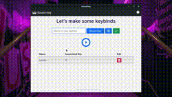

<h1 align="center">
    
</h1>

<h3 align="center"> Play the audio you want by pressing a single key </h3>

<p align="center">
  
  
  
  
  
  
  
</p>

<h4 align="center"> 
	 Status: Building
</h4>

<p align="center">
 <a href="#about">About</a> •
 <a href="#features">Features</a> •
 <a href="#installing-sound-key">Installing</a> • 
 <a href="#how-it-works">How it works</a> • 
 <a href="#tech-stack">Tech Stack</a> • 
 <a href="#contributing">Contributing</a> • 
 <a href="#author">Author</a> • 
 <a href="#license">License</a>

</p>

## About

Sound Key is an Electron APP that allows you to determinate some key on your keyboard to play any audio file.
You can use to play a determinate music that you love and like to listen every time. Or you are a **Streamer** and would be usefull if you could
play some sound effects in live. Use your imagination!

---

## Features

- [x]  Database integrated ( your keybinds will won't desapear after you close the app! )
- [x]  Always running ( the app still works even if you minimize the window )
- [x]  Showing your keybinds ( there's a dinamic table that shows the keybinds you already setted )
- [x]  Delete the unwanted ( delete that keybind you don't want anymore )
- [ ]  Dark mode

---

## Installing Sound Key as a executable (.exe)

Download the best installer for your operational system: 

[Windows x64](https://mega.nz/file/afYDCQ4S#wHXvVBlLlFooPCamyPwAauOYjsHM7LuROestjQqZypE)

[Windows x86](https://mega.nz/file/7DYVwACK#GI55twUyuatiFWD7XU6u5ouRCXUHrkxHUS4WiZOHRm4)

---

## Installing Sound Key as a project 

It is very simple, just follow the steps and you be okay!

### Pre-requisites

Before you begin, you will need to have the following tools installed on your machine:
[Git](https://git-scm.com), [Node.js](https://nodejs.org/en/).

You can also download by terminal, if you want
```bash
# Installing node via Snap
$ sudo snap install node --classic

# Installing Git
$ apt-get install git 
```

### Running the app

```bash
# Clone this repository
$ git clone https://github.com/daniloflorenzano/sound-key.git

# Acces the project folder terminal/cmd
$ cd sound-key-main

# Install the dependencies
$ npm install

# Run the application
$ npm start

# The app will open in a new window
```

---

## How it works

- Type the name of your keybind in the text space
- Click the "record" button and press any key you want to register
- Click the "upload" button to select a audio file
- Click the "submit" button to save your keybind



- Now click the "play" button. A tiny window should open, and that means your keyboard is been listen by the app. **Test your keybind!**
- To stop the app, click the "stop" button


---

## Tech Stack

The following tools were used in the construction of the project:

- [Node.js](https://nodejs.org/en/)
- [Electron](https://www.electronjs.org/)
- [SqLite](https://www.sqlite.org/index.html)
- [Sequelize](https://sequelize.org/)
- [IoHook](https://github.com/wilix-team/iohook)

---

## Contributing

Pull requests are welcome. For major changes, please open an issue first to discuss what you would like to change.

Please make sure to update tests as appropriate.

## How to contribute

1. Fork the project.
2. Create a new branch with your changes: `git checkout -b my-feature`
3. Save your changes and create a commit message telling you what you did: `git commit -m" feature: My new feature "`
4. Submit your changes: `git push origin my-feature`

---

## Author

Danilo Maia Florenzano

[](https://www.linkedin.com/in/daniloflorenzano/)
[](mailto:daniloflorenzano1@outlook.com)

👋🏽 [Get in Touch!](Https://www.linkedin.com/in/daniloflorenzano/)

---

## License

This project is under the license [MIT](./LICENSE).
